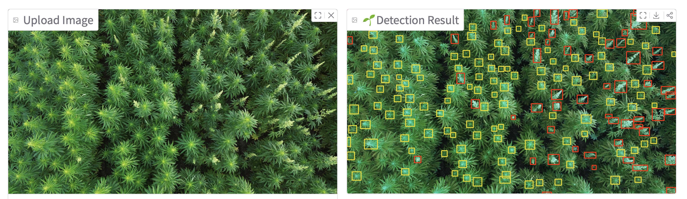

In our latest project, we’re bringing artificial intelligence to the hemp field. Using **drone imagery** and an advanced **YOLOv11 deep learning model**, our team has developed an automated system that can **detect and count male and female flowers in hemp plants** — a task that has traditionally required time-consuming and error-prone manual scouting.

Hemp’s flowering behavior plays a major role in determining crop quality, fiber yield, and seed production. Knowing exactly when male flowers appear and how flowering synchrony progresses across a field helps researchers and producers make informed management decisions. But identifying these small and often overlapping flowers by hand is extremely difficult, especially in dense canopies under changing light conditions.

To solve this, we trained a custom YOLOv11 model on **thousands of annotated drone images** captured from research plots at the University of Illinois Urbana-Champaign. The model learns to recognize subtle visual cues distinguishing male and female flowers under real field conditions. Once trained, it can process new field images in real time — highlighting detected flowers and reporting counts and ratios with impressive accuracy.

The system is deployed as an easy-to-use **web application**, allowing users to upload their own field photos and receive instant results through any browser, even on mobile devices. This lightweight tool is designed for breeders, agronomists, and farmers who want a quick, data-driven view of flowering progress without the need for specialized hardware or coding knowledge.

While this work is still ongoing and part of a larger research study, our goal is to make **AI-powered crop monitoring** more accessible for everyone involved in sustainable agriculture. In future posts, I’ll walk through the development steps — from dataset preparation and model training to web app deployment — and share insights into how such systems can help optimize crop performance, improve harvest timing, and enhance profitability in real-world production systems.

Stay tuned —

---

### 🌻 Try the Live Demo

Our YOLOv11-based **Hemp Flower Detection App** is now publicly available!  
You can upload hemp field images and instantly detect male and female flowers directly in your browser — no installation or coding required.

  <a href="https://huggingface.co/spaces/marshadu2024/hemp-flower-detect" target="_blank"
     style="background: linear-gradient(90deg, #007bff, #7b2ff7); color: white; font-weight:600;
     padding: 12px 26px; border-radius: 8px; text-decoration:none; font-size:16px;">
     🚀 Launch AI Demo
  </a>

---

